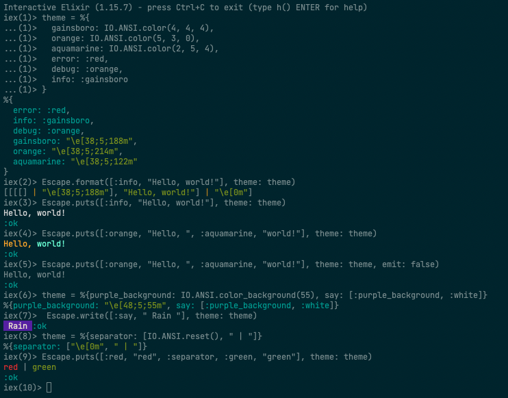

# Escape

[](https://hex.pm/packages/escape)
[](https://github.com/hrzndhrn/escape/actions)
[](https://github.com/hrzndhrn//blob/main/LICENSE.md)

The `Escape` module provides functionality to render ANSI escape sequences.

The module is similar to `IO.ANSI` but add a theme option to `Escape.format/2`.

Documentation can be found at [https://hexdocs.pm/escape](https://hexdocs.pm/escape).

## Installation

The package can be installed by adding `escape` to your list of
dependencies in `mix.exs`:

```elixir
def deps do
  [
    {:escape, "~> 0.1"}
  ]
end
```

## Examples


